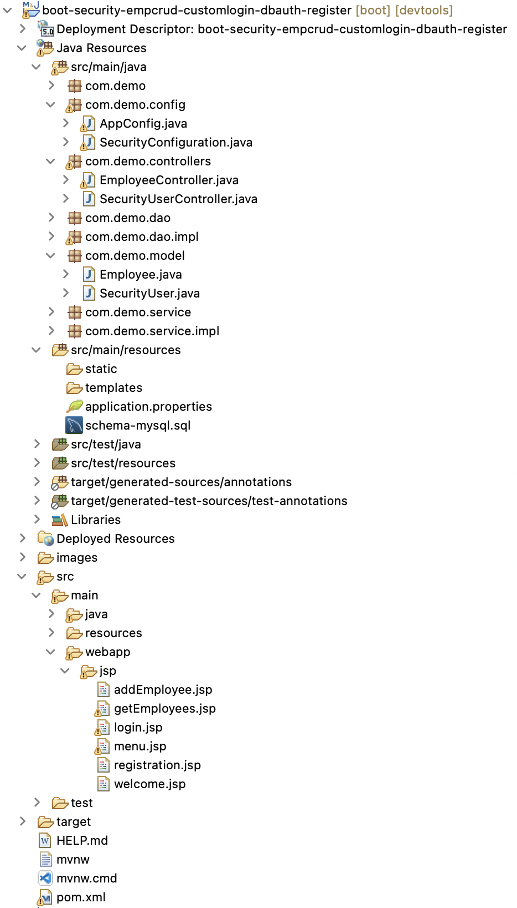
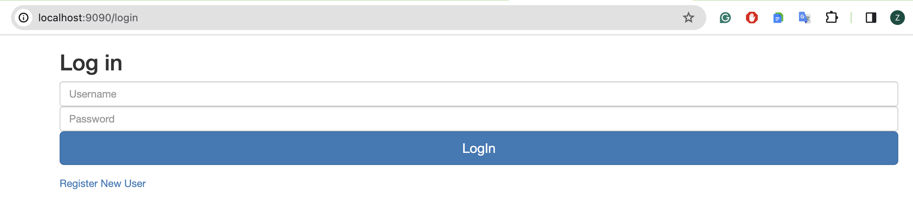
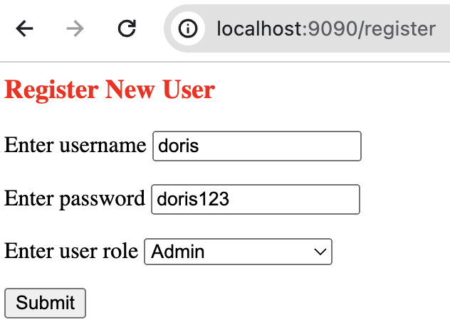
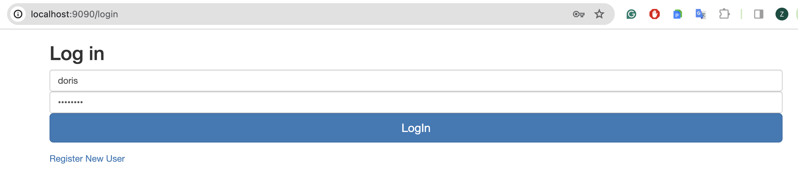
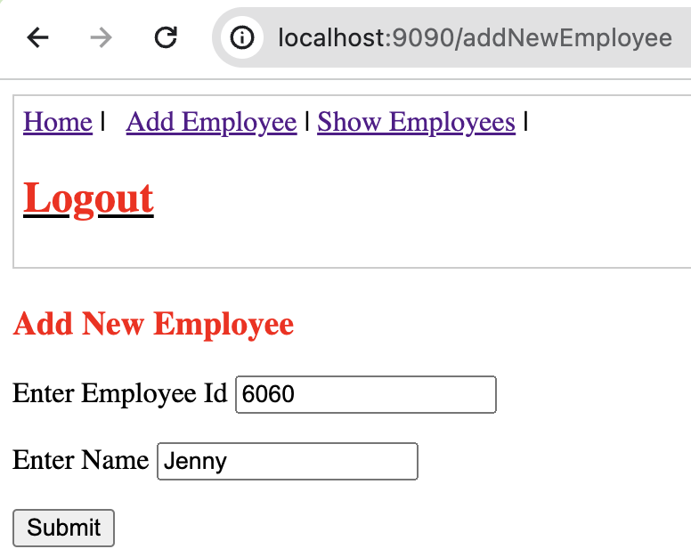
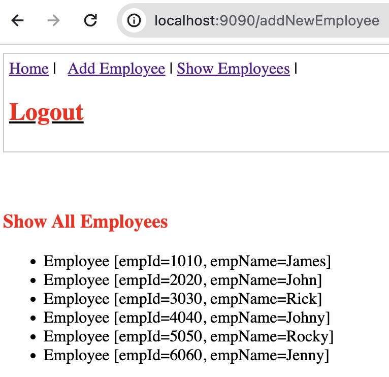
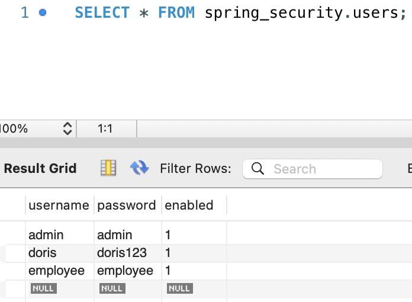
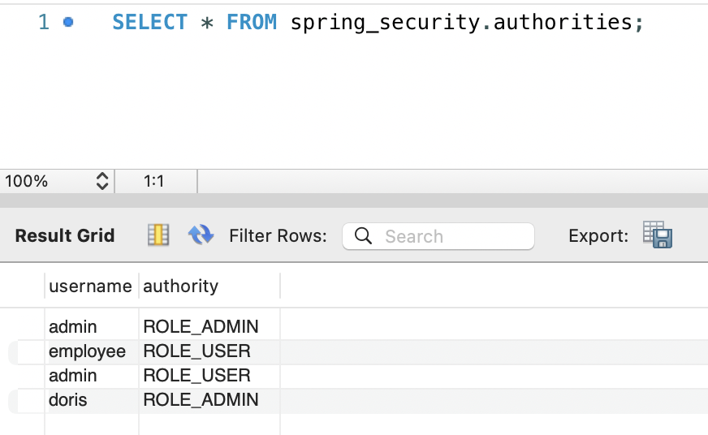

# spring-boot-security-customlogin-register-dbauth

This project creates a **Spring Boot REST API Application** for Employees along with **Custom Login Web Page**. Allow **User Registration** via UI and add the created security users to DB. And we authenticate users and roles against **Database Tables** instead of in memory configuration.

## Tools and Technologies Used

-   Spring Boot Starter 3.2.3
-   Spring Boot Starter Web 3.2.3
-   Spring Boot Starter Security 3.2.3
-   Spring Boot Starter JDBC 3.2.3
-   Java SE 17
-   Maven 3.9
-   Eclipse Spring Tool Suite4 (STS)
-   MySQL 8.x
-   JSTL 3.0
-   Tomcat 10.x

## About the Application
- Spring Boot REST API for Employees Create & Retrieve operations
- It demonstrates **REST API Security** where: 
  - User `employee` can access only `getEmployees` API
  - User `admin` can access APIs to `addEmployee` as well as `getEmployees`
  - **New user creation as `SecurityUser` before authentication by registration**, user could select their role there
- The security login page is a **custom login page** with a `/login API` in the REST Controller
- User security credentials are stored in the **MySQL Database**


## Project Structure: Spring Boot + Spring Security + REST API + MySQL + DB Authentication + Custom Login Form + JdbcUserDetails


## SecurityConfiguration.java
```
package com.demo.config;

import javax.sql.DataSource;

import org.springframework.beans.factory.annotation.Autowired;
import org.springframework.context.annotation.Bean;
import org.springframework.context.annotation.Configuration;
import org.springframework.security.config.annotation.authentication.builders.AuthenticationManagerBuilder;
import org.springframework.security.config.annotation.web.builders.HttpSecurity;
import org.springframework.security.config.annotation.web.configuration.EnableWebSecurity;
import org.springframework.security.core.userdetails.User;
import org.springframework.security.core.userdetails.UserDetails;
import org.springframework.security.crypto.password.NoOpPasswordEncoder;
import org.springframework.security.crypto.password.PasswordEncoder;
import org.springframework.security.provisioning.InMemoryUserDetailsManager;
import org.springframework.security.provisioning.JdbcUserDetailsManager;
import org.springframework.security.web.SecurityFilterChain;

@Configuration
@EnableWebSecurity
public class SecurityConfiguration {

	@Autowired
	DataSource dataSource;

	// Enable JDBC Authentication
	@Autowired
	public void configAuthentication(AuthenticationManagerBuilder auth) throws Exception {
		auth.jdbcAuthentication().dataSource(dataSource);
	}

	@Bean
	public JdbcUserDetailsManager jdbcUserDetailsManager() throws Exception {
		JdbcUserDetailsManager jdbcUserDetailsManager = new JdbcUserDetailsManager();
		jdbcUserDetailsManager.setDataSource(dataSource);
		return jdbcUserDetailsManager;
	}

	@Bean
	public SecurityFilterChain filterChain(HttpSecurity http) throws Exception {

		http.authorizeRequests().requestMatchers("/", "/images/**", "/css/**", "/js/**", "/jsp/**").permitAll()
				.requestMatchers("/register").permitAll()
				.requestMatchers("/welcome").hasAnyRole("USER", "ADMIN")
				.requestMatchers("/getEmployees").hasAnyRole("USER", "ADMIN")
				.requestMatchers("/addNewEmployee").hasAnyRole("ADMIN")
				.anyRequest().authenticated().and().logout().permitAll();

		http.formLogin(authz -> authz.loginPage("/login").permitAll());

		http.csrf().disable();

		return http.build();
	}

	@Bean
	public PasswordEncoder getPasswordEncoder() {
		return NoOpPasswordEncoder.getInstance();
	}
}
```

## SecurityController.java
```
package com.demo.controllers;

import java.util.ArrayList;
import java.util.List;

import org.springframework.beans.factory.annotation.Autowired;
import org.springframework.security.core.GrantedAuthority;
import org.springframework.security.core.authority.SimpleGrantedAuthority;
import org.springframework.security.core.userdetails.User;
import org.springframework.security.provisioning.JdbcUserDetailsManager;
import org.springframework.stereotype.Controller;
import org.springframework.ui.Model;
import org.springframework.web.bind.annotation.GetMapping;
import org.springframework.web.bind.annotation.ModelAttribute;
import org.springframework.web.bind.annotation.PostMapping;
import org.springframework.web.servlet.ModelAndView;

import com.demo.model.SecurityUser;

@Controller
public class SecurityUserController {

	@Autowired
	JdbcUserDetailsManager jdbcUserDetailsManager;

	@GetMapping("/login")
	public String login(Model model, String error, String logout) {
		if (error != null)
			model.addAttribute("errorMsg", "Your username and password are invalid.");
		if (logout != null)
			model.addAttribute("msg", "You have been logged out successfully.");
		return "login";
	}

	@GetMapping("/register")
	public ModelAndView register() {
		return new ModelAndView("registration", "user", new SecurityUser());
	}

	@PostMapping("/register")
	public ModelAndView processRegister(@ModelAttribute("user") SecurityUser securityUserObject) {
		// authorities to be granted
		List<GrantedAuthority> authorities = new ArrayList<GrantedAuthority>();
		authorities.add(new SimpleGrantedAuthority(securityUserObject.getUserRole()));
		User user = new User(securityUserObject.getUsername(), securityUserObject.getPassword(), authorities);
		jdbcUserDetailsManager.createUser(user);
		return new ModelAndView("redirect:/welcome");
	}
}
```

## DEMO
 The application is be available at [http://localhost:9090/welcome](http://localhost:9090/welcome)
### 1. The welcome page is secured, ask for user login, and the login page is customized


### 2. Registration, able to select user role


### 3. Login as the new user


### 4. The new user is an "admin", so it has access to addEmployee 


### 5. Also able to getEmployees


### 6. See the security user is added to "users" table in DB


### 7. The user authority is added to "authorities" table in DB

